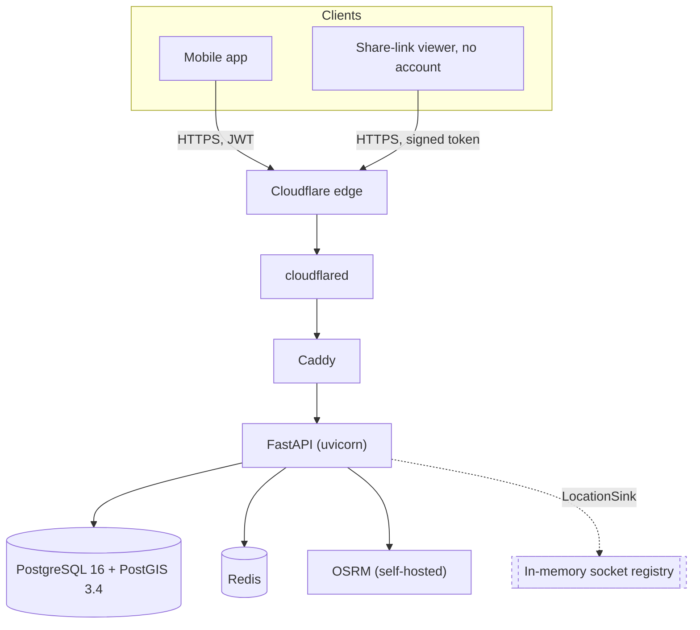

# Architecture

Status: Phase 0. The stack, its seams and the designed-not-built list are
settled. The ride state machine and the corridor matching diagram land with
Phases 3 and 6.

## Shape



Nothing but Caddy binds to the host. Postgres and Redis are reachable on the
internal network only. A Postgres exposed on 5432 with a hackathon password is
how a demo box becomes someone else's.

## Stack choices and what each one costs

| Layer | Choice | The tradeoff, honestly |
|---|---|---|
| API | Python 3.12, FastAPI | Pydantic makes boundary validation the framework rather than a discipline, and generates the OpenAPI document mobile needs. Iteration speed beats runtime speed at this scale. |
| Database | PostgreSQL 16, PostGIS 3.4 | The whole application is geo queries. `ST_DWithin` against a GiST index costs nothing to write; hand-rolled haversine filtering costs hours and is slower. |
| ORM | SQLAlchemy 2.0 async, GeoAlchemy2, Alembic | Typed models and real migrations, with raw SQL kept available for the two or three matching queries where the ORM fights back. |
| Realtime | Native FastAPI WebSockets, single process, in-memory registry | Horizontal scale needs Redis pub/sub. A demo does not. The seam is named below. |
| Routing | Self-hosted OSRM | No API key, no quota, no third-party outage during a live demo. That alone justifies the setup time. |
| Cache | Redis | Token buckets and OTP throttles want atomic operations with TTL. |
| Auth | Phone, OTP, short JWT with rotating refresh | Email login is the wrong primitive for this market. |
| Deploy | Docker Compose, TLS at the Cloudflare edge | One command, one host, TLS solved without waiting on DNS. |

### Why not Rust

Rust is the better production answer for location ingest and would be
defensible long-term. It is the wrong choice for 48 hours, for three specific
reasons.

The data model will change perhaps fifteen times on the first day, and `sqlx`
compile-time query verification, the main reason to reach for Rust here, turns
each of those into a rebuild-and-fix cycle. Request validation is not free
either: in FastAPI it *is* the framework, whereas in axum it is assembled, and
guaranteeing that every input is schema-validated is cheaper in Python. And
there is no hot path at this scale. Under twenty concurrent connections buys
performance nobody can observe, at a cost felt every hour.

We did not build a Python and Rust hybrid. Two toolchains, two deploy paths and
two debugging contexts in one weekend is a self-inflicted outage.

Location ingest is the component we would rewrite in Rust first. It is the only
path where per-message cost matters at ten thousand concurrent drivers, and it
is already isolated behind the `LocationSink` interface.

## Seams, and why they exist

Each of these is one interface with one implementation today. They are not
speculative abstraction; each names a decision we are deferring on purpose and
can point at when asked what happens at scale.

| Interface | Today | Later |
|---|---|---|
| `LocationSink` | In-process registry, direct fan-out | Redis pub/sub across processes |
| `RoutingProvider` | OSRM with timeout, one retry, haversine times 1.35 on failure | Hosted directions API behind the same two methods |
| `SmsSender` | Console sender, logs the code in development | A real gateway |
| `PaymentProvider` | Mock provider, works end to end | MTN MoMo, Orange Money |

The routing fallback matters more than it looks. A demo that dies because a
container fell over is a worse outcome than a route that is 35 percent
pessimistic for thirty seconds.

## Things that are deliberately not abstractions

The corridor query is written once, in SQL, and read directly. Wrapping it in a
repository layer would hide the one query whose plan we most need to be able to
look at.

The API contract lives in `app/schemas/` as its own package rather than beside
the routers, so that any diff touching the contract is visibly a contract
change.

## Error and authorization model

One envelope on every failure, so the client writes one error path:

```json
{"error": {"code": "RIDE_NOT_FOUND", "message": "...", "details": {}, "request_id": "..."}}
```

Codes are stable and SCREAMING_SNAKE. `message` is French by default and
honours `Accept-Language`.

Authorization failures on ride-scoped routes return **404, never 403**. A 403
confirms that a ride exists, which is information the caller has not earned.
Object-level authorization is a single dependency applied to every ride-scoped
route rather than a check inside each handler, because per-handler checks miss
one and the one they miss is the vulnerability.

Schema failures return 400. 422 is reserved for semantically invalid requests,
such as a dropoff outside the service area, so the client can tell "bad JSON"
apart from "outside Yaounde".

## Data residency

Law No. 2024/017 requires prior authorisation from the data protection authority
for cross-border transfer, and that authority assesses whether the destination
offers equivalent protection. Consequence: the deployment target is in-country
or in an authorised region, and this is an architectural decision made at the
start rather than a migration discovered later. The design keeps it a
single-host decision: one Compose file, one database, no managed service holding
personal data in an unassessed jurisdiction.

## Designed, not built

Each of these is a real design we can describe in full. Describing them earns
most of the credit at none of the cost, and being explicit that they are not
built is the point.

**HMAC pickup beacon.** BLE phone-to-phone proximity was evaluated and rejected
for pickup verification: proximity is not identity, and a raw broadcast can be
relayed or replayed. Done properly it is a short-lived HMAC over `ride_id` plus
a timestamp under a per-ride key, exchanged over BLE and verified server-side.
The four-digit PIN delivers the same security property today at a fraction of
the work. The beacon is the documented next step, not a missing feature.

**Encrypted incident audio.** Recorded on-device, encrypted with a random
per-incident data key, that key wrapped with a server-held public key, uploaded
only when a report is actually filed, and auto-purged after a fixed window, so
that nobody at the company can casually listen to a trip. We did not build
continuous recording, because recording infrastructure without that key
management is surveillance wearing a safety label. This design is what separates
trust infrastructure from surveillance, and it is worth more said out loud than
half-built.

**Redis pub/sub fan-out.** The `LocationSink` swap described above.

**Rust location ingest.** As described above.

**Prepaid weekly commuter pass.** N trips on a fixed home-to-work corridor at a
discount. It is the right monetisation for this market: predictable revenue,
obvious perceived value, it locks in the corridor feature, and its prepaid
balance solves cancellation-fee enforcement without asking anyone to preload a
wallet. Notably *not* a subscription that charges users to remove friction, and
not personalisation-as-a-product: there is no training data at demo time, and
preferences are cheap to store and should be given away.

## Build phases

| Phase | Scope | State |
|---|---|---|
| 0 | Contract, skeleton, deploy | done |
| 1 | Identity, auth, KYC gate | done |
| 2 | Geo core, gazetteer, fare quoting | next |
| 3 | Ride lifecycle and matching | |
| 4 | Realtime tracking, driver simulator | |
| 5 | Trust and safety | |
| 6 | Accessibility, corridor, payment abstraction | |
| 7 | Harden, seed, document, rehearse | |

Contract questions resolved at Phase 0 are in
[docs/CONTRACT_DECISIONS.md](docs/CONTRACT_DECISIONS.md), including two places
where the original data model could not be built as written.
