# VORA

Mobilite intelligente pour le contexte urbain camerounais. Yaounde d'abord,
Douala ensuite.

**Hackathon NuxCine 2026, Groupe 20.**

Documentation technique detaillee en anglais: [README.en.md](README.en.md),
[ARCHITECTURE.md](ARCHITECTURE.md), [THREAT_MODEL.md](THREAT_MODEL.md).
Manuel de demarrage pas a pas: [DEMARRAGE.md](DEMARRAGE.md).


<p align="center">
  
  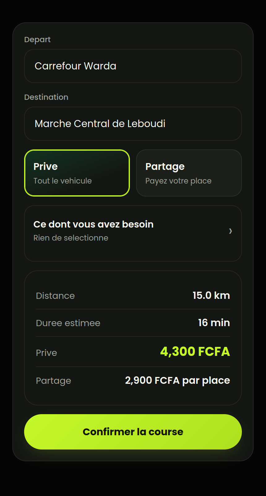
  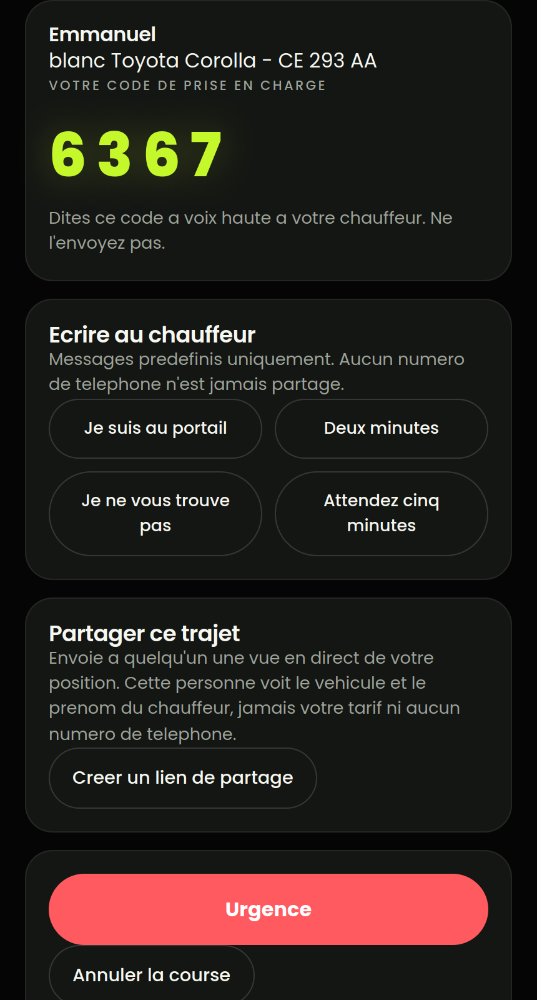
</p>

<p align="center">
  <em>L'ecran d'ouverture, les deux tarifs cote a cote, et le code de prise en
  charge. Toutes les captures viennent de l'application en marche sur la base
  de donnees chargee: <a href="docs/screenshots/">la serie complete</a>.</em>
</p>

---

## 1. Presentation

VORA met en relation des passagers et des chauffeurs a Yaounde. Ce n'est pas
une copie d'une application de VTC existante: le modele de transport dominant
ici n'est pas la location exclusive d'un vehicule, c'est le taxi partage qui
fait du ramassage le long d'un corridor, a un tarif par place. VORA numerise ce
modele et ajoute la course exclusive par-dessus, et non l'inverse.

Deux paris structurent le produit:

1. **La recherche par reperes locaux.** Personne ne se deplace ici avec une
   adresse. On dit "Carrefour Warda", "Total Nsimeyong", "derriere la Poste
   Centrale". La resolution passe par un dictionnaire de 5454 lieux avec
   correspondance floue et insensible aux accents.
2. **Les courses en corridor.** Deux reservations partagent un vehicule, chacune
   payant sa propre portion, mesuree le long du trajet reellement parcouru.

## 2. Probleme

Ce que le contexte impose, et ce que nous en avons fait:

| Realite | Consequence dans le produit |
|---|---|
| L'adressage par rue est quasi inexistant | Recherche par reperes, pas par adresse |
| Le partage de taxi est la norme, pas l'exception | Le corridor est un mode de premiere classe |
| Le paiement se fait en especes | Aucun mouvement d'argent, un registre de dettes |
| On paie avec les pieces qu'on a | Tout tarif est arrondi a 50 XAF |
| La connexion coupe | Degradation annoncee, jamais silencieuse |
| Les telephones sont modestes | Application web installable, pas un binaire de 40 Mo |
| La Loi 2024/017 interdit le traitement des donnees de sante | Aucune donnee de sante, jamais |
| Un passager monte dans la voiture d'un inconnu | Code PIN a la prise en charge, partage de course, SOS |

Deux de ces lignes meritent une phrase de plus, parce qu'elles ne se voient pas
a l'ecran.

**L'arrondi a 50 XAF n'est pas cosmetique.** Un tarif de 1 237 XAF ne se paie
pas en especes sans que le chauffeur cherche la monnaie. Le prix affiche doit
etre un prix qui peut reellement changer de main. L'arrondi est fait au demi
superieur et non par la fonction `round` de Python, qui envoie les moities vers
le multiple pair: 25 XAF descendrait a zero pendant que 75 monterait a 100.
Traiter deux moities identiques differemment est exactement ce qu'un chauffeur
remarque, et apres quoi il cesse de faire confiance a l'application.

**"Degradation annoncee" veut dire que la reponse le dit elle-meme.** Quand le
moteur d'itineraire ne repond pas, l'estimation bascule sur un calcul a vol
d'oiseau et le champ `routing_source` passe de `osrm` a `haversine_fallback`.
Le client peut donc prevenir le passager que l'estimation est approximative.
Une estimation degradee qui se presente comme exacte serait pire qu'une erreur.

## 3. Notre solution

Un ecosysteme en trois interfaces sur une seule API:

- **Passager**: compte, recherche de destination, itineraire, estimation,
  reservation, suivi, annulation, historique, partage de course, SOS,
  besoins specifiques.
- **Chauffeur**: mise en service, reception et acceptation des demandes,
  navigation, verification du PIN, fin de course, gains, historique, securite.
- **Administration**: synthese de la flotte, file de validation KYC avec
  decision reelle.

## 4. Fonctionnalites

<table>
  <tr>
    <td align="center">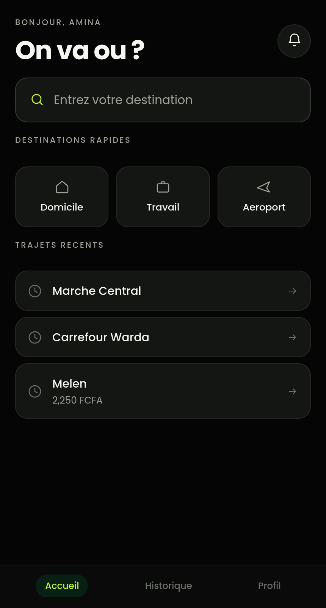<br><sub>Accueil</sub></td>
    <td align="center"><br><sub>Historique</sub></td>
    <td align="center">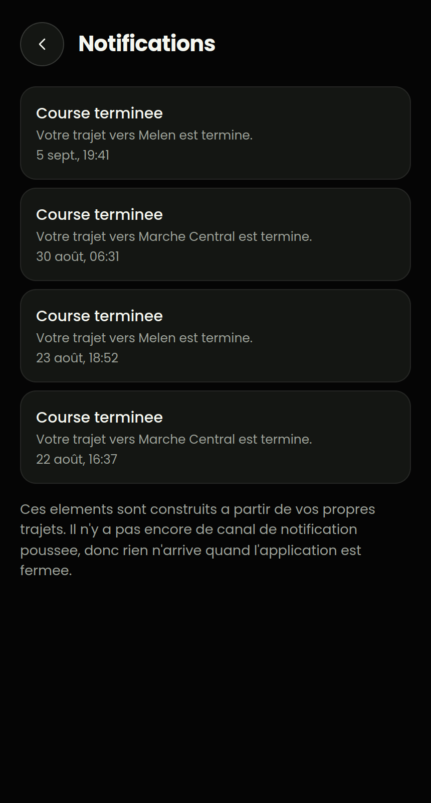<br><sub>Notifications</sub></td>
    <td align="center">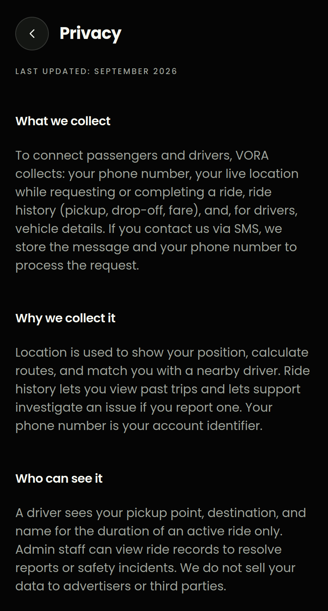<br><sub>Confidentialite</sub></td>
  </tr>
  <tr>
    <td align="center"><br><sub>Connexion</sub></td>
    <td align="center">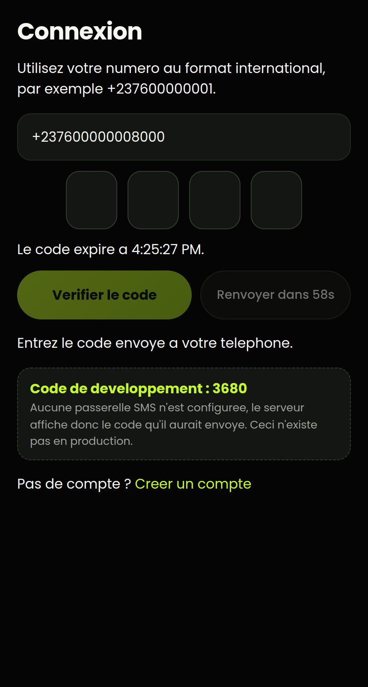<br><sub>Code OTP</sub></td>
    <td align="center">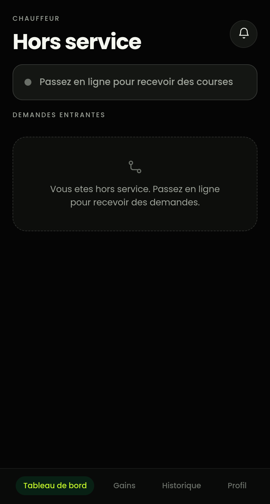<br><sub>Chauffeur hors service</sub></td>
    <td align="center">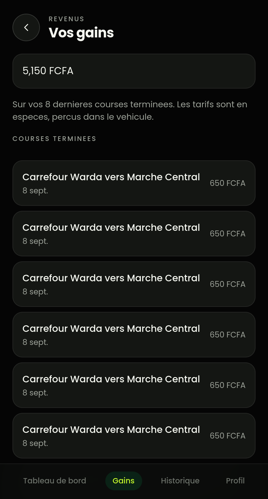<br><sub>Gains du chauffeur</sub></td>
  </tr>
</table>

**Passager**

- Creation de compte et connexion par OTP SMS, sans mot de passe
- Recherche de destination par repere local, avec la provenance du resultat
- Carte, itineraire et estimation de duree
- Estimation du prix signee par le serveur, valable une seule fois
- Deux modes: exclusif ou partage, avec les deux tarifs affiches
- Reservation, recherche de chauffeur, suivi en direct
- Code PIN a quatre chiffres a la prise en charge
- Annulation, avec les consequences annoncees avant de confirmer
- Historique des courses
- Partage de course par lien signe, revocable
- Bouton SOS et signalement d'incident
- Messages predefinis, sans echange de numero de telephone
- Besoins specifiques pour la course (voir §5)
- Choix de la langue, francais ou anglais

**Chauffeur**

- Connexion, profil, informations sur le vehicule
- Passage en service et hors service
- Reception des demandes avec le tarif et les deux etapes
- Acceptation ou refus
- Position GPS transmise pendant la course
- Saisie du PIN du passager pour demarrer
- Instructions du passager affichees comme des actions a faire
- Annonce vocale de l'itineraire sur son propre telephone
- Fin de course, gains, historique
- Ecran de securite et signalement

**Administration**

<p align="center">
  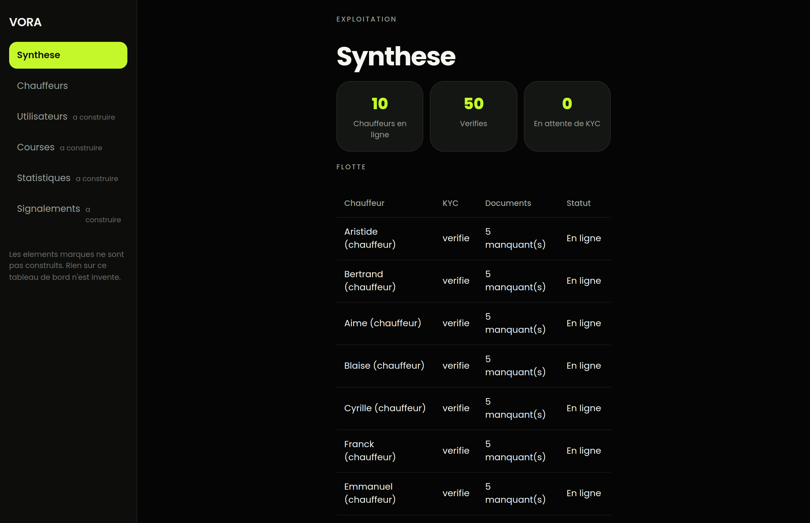
  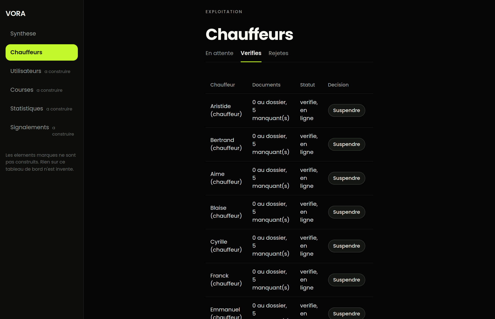
</p>

- Synthese: chauffeurs en ligne, verifies, en attente
- File KYC avec approbation, rejet motive et suspension
- Les ecrans non construits le disent, ils n'affichent pas de fausses lignes

## 5. Innovation

Quatre choses que nous n'avons vues nulle part ailleurs sur ce marche.

### Les courses en corridor

Deux reservations partagent un vehicule. Chacune paie sa propre portion,
mesuree **le long du trajet reellement parcouru** avec PostGIS, et non un tarif
divise en deux.

Verifie sur un trajet reel de 7,5 km:

| | Paie | Aurait paye seul | Economise |
|---|---|---|---|
| Passager A | 1550 | 2300 | 750 |
| Passager B | 900 | 1300 | 400 |
| **Le chauffeur encaisse** | **2450** | 2300 | **+150** |

Les deux passagers paient moins, et le chauffeur gagne plus qu'une course
exclusive, parce que le vehicule n'est pas vendu a une seule personne.

Le critere n'est pas la proximite mais la contenance: les deux points doivent
se trouver sur la ligne deja parcourue, dans le sens de la marche. Un candidat
a 278 m de la ligne est refuse a 15,3 % de detour pour un plafond de 8 %.
**46 verifications passent.**

**Le chauffeur est consulte, jamais force.** Aucun passager n'est ajoute
automatiquement a une course en train de se faire. C'est le chauffeur qui a
quelqu'un dans sa voiture et qui doit gerer la rencontre, donc c'est lui qui
decide, et un refus ne lui coute rien. Une plateforme qui impose les
ramassages perd ses chauffeurs.

**La place est bloquee a la demande, pas a la reponse.** Tant que le chauffeur
n'a pas repondu, la place compte deja comme vendue. Sans cela, deux passagers
peuvent se voir proposer la meme derniere place pendant les quelques secondes
de reflexion, et l'un des deux ne l'apprend qu'au bord de la route.

Regle de securite: deux reservations au maximum, et le second passager voyage
a l'avant, seul. Le premier passager peut monter avec ses proches; un inconnu
qui rejoint la course reste une seule personne, dans le champ de vision du
chauffeur, et personne ne se retrouve assis a l'arriere a cote d'un inconnu.
Une troisieme reservation est refusee meme quand la geometrie est parfaite:
la limite porte sur les reservations, pas sur les places.

### La recherche par reperes

<p align="center">
  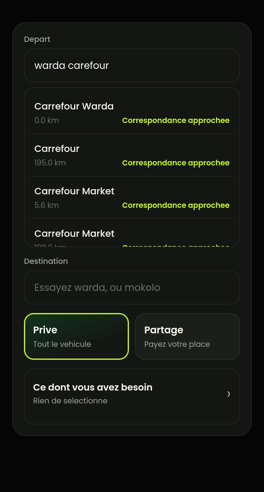
  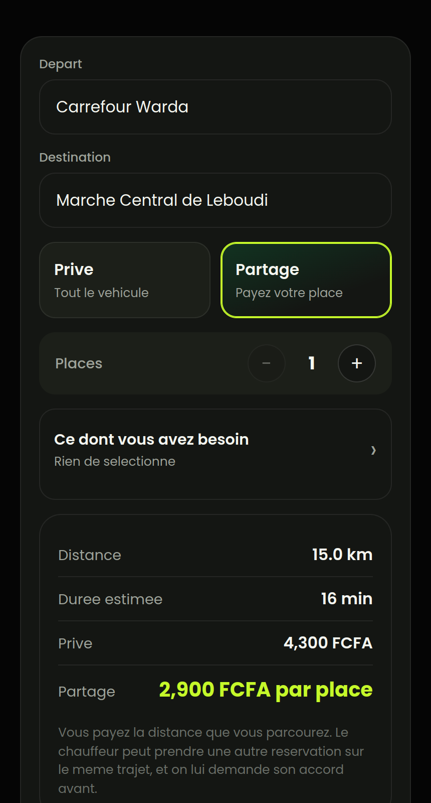
  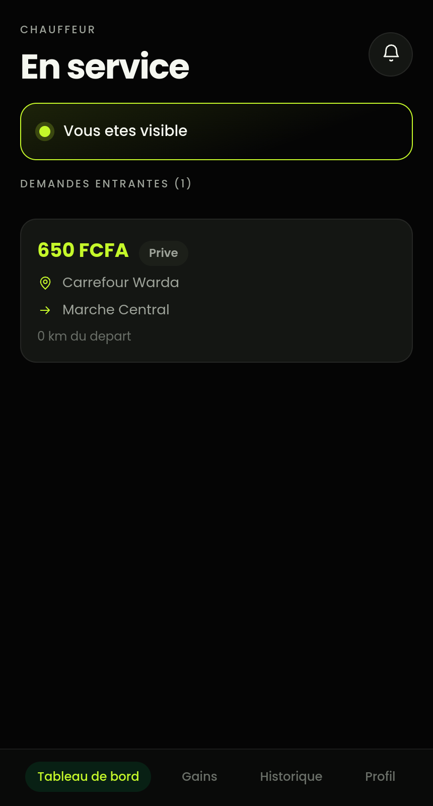
</p>

Tapez "warda carefour", mal orthographie et dans le desordre: le lieu est
trouve, et le resultat dit **pourquoi** il a ete trouve ("correspondance
exacte", "correspondance approchee", "quartier"). **90,5 % de reussite dans les
trois premiers resultats sur 42 requetes reelles**, 100 % sur les accents et
les formes exactes, 87,5 % sur les fautes d'orthographe. La correspondance
floue s'execute dans l'index Postgres, jamais en Python.

### L'accessibilite sans donnee de sante

<p align="center">
  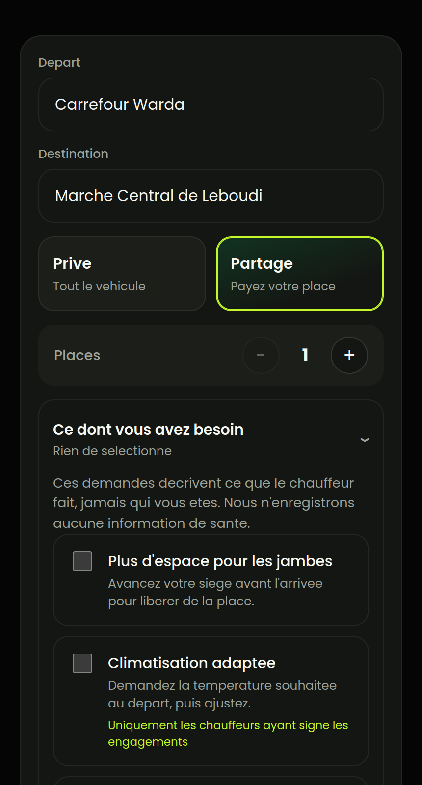
  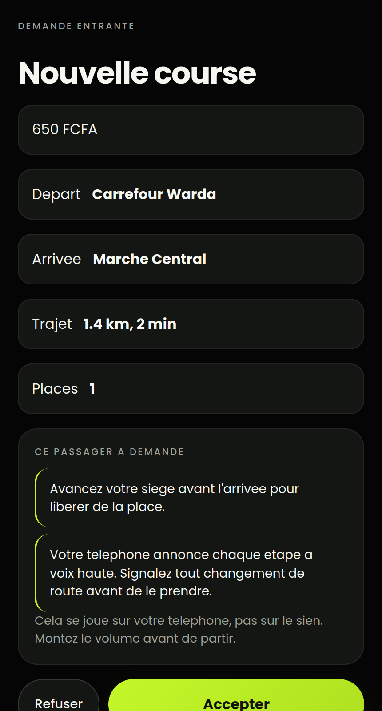
</p>

<p align="center">
  <em>A gauche ce que le passager demande, a droite ce que le chauffeur lit
  avant d'accepter: une instruction, jamais une raison.</em>
</p>

Sept besoins: espace pour les jambes, climatisation adaptee, vitres fermees,
itineraire annonce a voix haute, visite guidee, trajet silencieux, autre chose.

**Chacun decrit ce que le chauffeur fait. Aucun n'enregistre quoi que ce soit
sur la personne.** Quelqu'un de grand et quelqu'un a mobilite reduite
choisissent la meme option et le systeme est incapable de les distinguer. La
Loi No. 2024/017 interdit le traitement des donnees de sante, et voici a quoi
ressemble la conformite dans le code plutot que dans un document de politique.

L'annonce vocale tourne sur **le telephone du chauffeur**, pas sur celui du
passager. C'est tout l'interet: un passager qui ne voit pas la route n'a aucun
moyen de distinguer un raccourci d'un mauvais virage si personne ne le dit a
voix haute, dans la voiture, au moment ou cela se produit. Les chauffeurs
signent des engagements: le faire poliment, et sans facturer de supplement.

### L'economie de la confiance, avec un attaquant a l'interieur

Un chauffeur qui accepte une course puis reste immobile **ne gagne rien**,
parce que le releve GPS du serveur prouve qu'il ne s'est pas approche du point
de depart. Les frais d'annulation sont inscrits a un registre de dettes, et un
solde impaye bloque la reservation suivante. C'est ce qui rend des frais reels
sur un marche ou tout se paie en especes et ou il n'existe aucun rail de
paiement. **20 cellules de politique sur 20 verifiees.**

## 6. Securite

Detail complet dans [THREAT_MODEL.md](THREAT_MODEL.md). Ce sont des contraintes
sur le schema, pas des preferences produit.

**Comptes**

- Authentification par OTP, code hache avec argon2 a 32 Mio de memoire
- Jetons d'acces courts, jetons de rafraichissement rotatifs avec detection de
  reutilisation
- Limitation de debit en couches sur l'envoi d'OTP, fermeture en cas de panne
- Roles separes: passager, chauffeur, administrateur

**Passagers**

- Code PIN a la prise en charge, hache, cinq tentatives maximum, **jamais
  transmis au chauffeur**
- Partage de course par lien signe, expirant, revocable, volontairement
  imprecis tant que la course n'a pas demarre
- SOS scellant un instantane immuable, impose par un declencheur en base
- **Aucun endpoint ne renvoie le numero de telephone de l'autre partie**, dans
  aucun etat de la course
- Messages predefinis a la place du telephone

**Chauffeurs**

- Validation KYC avant toute mise en service, refusee tant qu'un document
  manque, et cette regle vit dans le service et non dans une console
- Signalement d'un passager, ecran de securite, alerte
- La position precise n'est visible que par le passager assigne, et seulement
  entre l'acceptation et la fin de course

**Technique**

- Echecs d'autorisation renvoyant **404 et jamais 403**: l'existence d'une
  course est elle-meme une information
- Tarifs calcules cote serveur a partir du releve GPS du serveur, avec filtre
  de plausibilite. Une distance annoncee par le client n'entre jamais dans un
  prix
- Requetes parametrees partout, jamais de concatenation SQL
- `ride_events` en ajout seul, impose par un declencheur
- En-tete `Idempotency-Key` obligatoire a la reservation
- **Aucun secret dans le depot.** Tout passe par des variables d'environnement,
  documentees dans [.env.example](.env.example), verifiees par
  `./scripts/security_audit.sh`
- Aucune cle cote client. Les identifiants de carte, de routage et de
  messagerie restent cote serveur

**Le journal des courses est en ajout seul, et c'est une contrainte de base de
donnees.** Pas une convention, pas un simple retrait de droits: l'application
se connecte en proprietaire de la table et un proprietaire contourne les
droits. Le declencheur, lui, se declenche pour tout le monde. `ride_events` est
la couche de preuve sur laquelle reposent une contestation de tarif, un
signalement de securite et la notification de violation exigee par la Loi
2024/017. Un journal d'audit modifiable n'est pas un journal d'audit.

## 7. Architecture

```
   Passager (PWA)      Chauffeur (PWA)      Administration (web)
         |                    |                      |
         +--------------------+----------------------+
                              |
                        Caddy (une seule origine)
                              |
                     API FastAPI (HTTP + WebSocket)
                              |
       +----------------+-----+------+----------------+
       |                |            |                |
  PostgreSQL 16      Redis         OSRM          Passerelle SMS
   + PostGIS      (limites,     (itineraires)     (HTTPSMS)
                   presence)
```

Une seule origine, c'est delibere: Caddy sert l'application et relaie `/api/*`,
donc le paquet livre au navigateur ne contient aucun nom d'hote et fonctionne
sans changement depuis localhost, une adresse du reseau local ou le tunnel
public. Detail dans [ARCHITECTURE.md](ARCHITECTURE.md).

## 8. Technologies

| Couche | Choix | Pourquoi |
|---|---|---|
| API | FastAPI, Pydantic v2 | Le contrat est genere depuis le code, donc il ne derive pas |
| Base | PostgreSQL 16 + PostGIS 3.4 | La geometrie est le coeur du produit; le corridor est une requete SQL |
| ORM | SQLAlchemy 2.0 async, asyncpg | Concurrence reelle sur un seul processus |
| Migrations | Alembic, ecrites a la main | L'autogeneration se trompe sur les types spatiaux |
| Cache et limites | Redis 7, scripts Lua | Un seau a jetons doit etre atomique |
| Itineraires | OSRM auto-heberge | Aucun cout par requete, aucune fuite de trajet vers un tiers |
| Client | React 19, Vite 7 | Un seul paquet pour les trois interfaces |
| Carte | Mapbox GL | Le jeton client est public et restreint par domaine |
| Serveur web | Caddy | TLS automatique, une seule origine |
| Acces public | Cloudflare Tunnel | TLS reel sur un nom d'hote reel, sans VPS |
| SMS | HTTPSMS via un telephone Android | Aucun contrat operateur necessaire |

Limites assumees: OSRM demande environ 1 Go de memoire, Mapbox est un service
tiers, HTTPSMS a le debit d'un seul telephone.

## 9. Installation

Docker avec Compose v2 suffit. Rien d'autre.

```bash
git clone git@github.com:rdzouk/NUXCINE-HACKATHON-GROUP-20.git
cd NUXCINE-HACKATHON-GROUP-20
cp .env.example .env
./scripts/gen_secrets.sh
```

Instructions detaillees, y compris Windows et WSL: [DEMARRAGE.md](DEMARRAGE.md).

## 10. Configuration

Une seule cle doit etre fournie a la main, celle de Mapbox. Toutes les autres
sont generees par `./scripts/gen_secrets.sh`.

```bash
# .env
VITE_MAPBOX_TOKEN=pk.votre_jeton_public_mapbox
```

Le jeton doit commencer par `pk.`. Un jeton `sk.` est un secret serveur et
l'application le refuse explicitement plutot que de le livrer au navigateur.

Sans jeton, la carte affiche un espace annonce comme tel et le reste de
l'application continue de fonctionner.

## 11. Variables d'environnement

Modele complet et commente: [.env.example](.env.example). Les principales:

| Variable | Role |
|---|---|
| `VITE_MAPBOX_TOKEN` | Jeton public Mapbox. Le seul secret livre au navigateur, et il n'en est pas un |
| `VITE_API_BASE_URL` | `/api/v1`, relatif, parce que Caddy sert une seule origine |
| `JWT_SECRET` | Signature des jetons d'acces |
| `QUOTE_HMAC_SECRET` | Signature des estimations de prix. Jamais la meme que `JWT_SECRET` |
| `SHARE_TOKEN_SECRET` | Signature des liens de partage |
| `KYC_ENCRYPTION_KEY` | Chiffrement AES-GCM des champs KYC au repos |
| `POSTGRES_*` | Connexion a la base |
| `REDIS_URL` | Connexion a Redis |
| `OSRM_ENABLED` | `false` tant que le graphe de routage n'est pas construit |
| `ALLOW_TEST_NUMBERS` | `true` en developpement: le code OTP s'affiche a l'ecran |
| `HTTPSMS_API_KEY` | Envoi reel des SMS. Vide, les codes sont journalises |

**Aucune valeur reelle n'est dans le depot.** `.env` est ignore par git et le
scan de secrets fait partie de `./scripts/security_audit.sh`.

## 12. Base de donnees

PostgreSQL 16 avec PostGIS 3.4, demarre par Compose. Rien a installer.

```bash
docker compose up -d          # demarre la base
./scripts/seed.sh             # migre et charge les donnees de demonstration
```

`seed.sh` attend que la pile soit prete, applique les migrations Alembic, puis
charge:

- 5454 lieux du dictionnaire de Yaounde
- 12 chauffeurs verifies et en ligne, avec un eventail volontaire de capacites
  (3 avec rampe, plusieurs avec coffre, un qui refuse les animaux guides)
- 5 passagers et 20 courses terminees
- 1 compte administrateur

Le script est idempotent: chaque semeur possede un bloc de numeros reserve et
converge au lieu de recreer, parce que `rides.passenger_id` est en
`ON DELETE RESTRICT` et que `ride_events` est en ajout seul.

## 13. Lancement du projet

```bash
docker compose up -d && ./scripts/seed.sh
```

L'application est alors sur **http://localhost:8090**.

Pour verifier que tout est reellement pret avant une demonstration:

```bash
./scripts/demo.sh --check
```

Pour une adresse publique en HTTPS, utilisable depuis un telephone:

```bash
docker compose logs cloudflared | grep trycloudflare.com
```

## 14. Comptes de demonstration

Il n'y a pas de mot de passe: la connexion se fait par code OTP. Ces numeros
sont dans la plage de test, donc **le code s'affiche directement a l'ecran**.

| Role | Numero | Nom |
|---|---|---|
| Passager | `+237600000008000` | Amina |
| Passager | `+237600000008001` | Josephine |
| Chauffeur | `+237600000009000` | Emmanuel |
| Chauffeur | `+237600000009001` | Aristide |
| Administrateur | `+237600000007000` | Superviseur VORA |

Pour une demonstration a deux roles, ouvrez le passager dans une fenetre
normale et le chauffeur dans une fenetre de navigation privee. Les deux
partagent sinon le meme stockage local et se deconnectent mutuellement.

## 15. Structure du projet

```
app/schemas/      le contrat d'API, fige. Une modification ici est un changement de contrat
app/api/v1/       les routes, un module par groupe
app/services/     la logique metier: corridor, tarifs, geocodage, securite
app/models/       les tables SQLAlchemy
app/middleware/   identifiant de requete, en-tetes de securite, plafond de corps, delai
migrations/       Alembic, ecrites a la main
features/         le client React: passenger, driver, admin, map, shared
public/           manifeste PWA, service worker, icones
scripts/          semeurs, harnais d'acceptation, audit de securite, demarrage
bruno/            la demonstration sous forme de collection d'API executable
docs/             decisions de contrat et notes de phase
design-prototype/ la maquette de l'equipe design. Reference visuelle, non executee
ui/vora/          la premiere maquette HTML/CSS. Historique, non executee
backend/          une proposition de passerelle SMS, marquee BROUILLON, non integree
```

Deux dossiers sont conserves pour l'historique et ne font pas partie de
l'application: `ui/vora/` et `backend/`. **L'application se lance depuis la
racine**, jamais depuis `backend/`.

## 16. API utilisees

| Service | Usage | Cle requise |
|---|---|---|
| Mapbox GL JS | Affichage de la carte cote client | `VITE_MAPBOX_TOKEN`, publique |
| OSRM | Calcul d'itineraire, distance, duree | Aucune, auto-heberge |
| OpenStreetMap | Source du dictionnaire de lieux | Aucune, extrait hors ligne |
| HTTPSMS | Envoi des OTP par un telephone Android | `HTTPSMS_API_KEY`, cote serveur |
| Cloudflare Tunnel | Adresse publique en HTTPS | Optionnelle |

L'API de VORA elle-meme expose 35 chemins. Contrat complet dans
[openapi.json](openapi.json), et `/docs` en developpement.

## 17. Limites connues

Dites plutot que cachees.

- **Aucune evaluation du chauffeur.** La note moyenne est affichee mais aucun
  endpoint ne la collecte. Il faudrait `POST /rides/{id}/rating` et le calcul
  d'une moyenne.
- **Administration limitee a deux endpoints.** Utilisateurs, courses,
  statistiques et signalements ne sont pas construits, et ces ecrans le disent
  au lieu d'afficher des lignes inventees.
- **Les gains du chauffeur sont calcules cote client** a partir de la page de
  courses renvoyee par l'API, donc une semaine chargee serait sous-comptee. Il
  faudrait `GET /driver/earnings` avec l'agregation faite dans Postgres.
- **Paiement en especes uniquement.** L'interface de fournisseur de paiement
  existe, avec une implementation especes et une implementation simulee, mais
  aucun prestataire reel n'est integre. C'est un choix: aucun rail de paiement
  mobile n'etait integrable serieusement en 48 heures, et un faux paiement est
  pire qu'un paiement honnete en especes.
- **Notifications dans l'application seulement.** Pas de notification poussee.
- **Le service worker ne met pas l'API en cache.** Une course, une position et
  un tarif ne valent plus rien une minute plus tard, et servir une version
  perimee serait pire qu'une erreur honnete.
- **HTTPSMS a le debit d'un seul telephone.** C'est un mecanisme de pilote, pas
  une passerelle de production.
- **La signature des engagements chauffeur n'a pas d'ecran.** L'endpoint et la
  contrainte en base existent; l'ecran de signature n'a pas ete construit.
- **Le paquet JavaScript fait 2,2 Mo** avant compression, 624 ko apres. Il
  faudrait le decouper par route.

## 18. Membres de l'equipe

| Membre | Role | GitHub |
|---|---|---|
| Fonyuy Berka Dzekem Junior | Backend, securite, integration | `Maestro-jr` |
| Gaetan Kengne | Team lead, frontend, coordination | `rdzouk` |
| Adong Habib Samuel | Frontend, ecrans | `habibsamuel7` |

Contributions verifiables dans l'historique git et les branches
`feature/backend-phase01`, `feature/map`, `feature/app-pages`,
`feature/sms-backend-proposal`, `vora-ui-mock`.

## 19. Figma

Maquettes et prototype: **[a completer avant la soumission]**

La maquette de l'equipe design est aussi dans le depot, sous
`design-prototype/`, comme reference visuelle. Elle n'est pas executee et n'est
pas connectee a l'API.

## 20. Demonstration

Verifier que la pile est prete:

```bash
./scripts/seed.sh && ./scripts/demo.sh --check
```

Le deroulement complet, chronometre, avec les huit temps de la demonstration:

```bash
./scripts/demo.sh
```

Ce que l'on peut montrer a l'ecran: la recherche par repere avec la provenance
du resultat, les deux tarifs cote a cote, l'arrivee de la demande chez le
chauffeur, le PIN, le partage de course, le choix des besoins, la file KYC, la
langue, l'installation en PWA.

Ce qui se prouve par script: 0 fuite sur le balayage IDOR, exactement un
gagnant sur 20 acceptations simultanees, le filtre anti-falsification GPS, la
matrice d'annulation 20 sur 20, la degradation 17 sur 17.

**Verifie, pas seulement affirme:**

| | |
|---|---|
| tests unitaires | 173 |
| suites d'acceptation | 16, chacune passante |
| audit de securite | 14 verifications |
| economie du corridor | 46 verifications, deux reservations sur un vehicule |
| chaine des besoins | 9 verifications, du formulaire a l'ecran du chauffeur |
| degradation | 17 verifications, chaque dependance tuee puis retablie |
| audit de dependances | aucune vulnerabilite connue |
| scan de secrets | aucun secret dans l'historique git |

Une remarque honnete sur l'enchainement des seize suites. Chaque connexion
coute deux hachages argon2 a 32 Mio, deliberement, parce qu'un code a quatre
chiffres n'est sur que si le hachage est couteux en memoire. Sur une machine de
developpement modeste, les suites font donc la queue les unes derriere les
autres, et une suite qui passe seule peut depasser le delai de quinze secondes
de l'API. Les echecs se deplacent d'une execution a l'autre, ce qui est la
signature d'une contention et non d'un defaut: chaque suite passe seule.
`ACCEPTANCE_SETTLE_S` espace les suites. La bonne reponse est d'etaler la
charge, jamais d'affaiblir le hachage ni d'allonger le delai.
