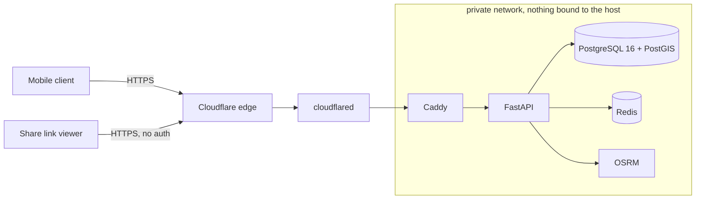

# VORA

Smart mobility for the Cameroonian urban context. Yaounde first, Douala second.

This repository holds the backend, the data model, the API contract and the
security work. The mobile client is built against `openapi.json`.



## What makes this different from a ride-hailing clone

**Landmark-first geocoding.** Street addressing is functionally absent for most
trips here. People navigate by carrefours, stations, markets and quartiers:
"Carrefour Warda", "Total Nsimeyong", "derriere la Poste Centrale". The primary
resolution path is a curated gazetteer with trigram and accent-insensitive
matching, done in the Postgres index rather than in Python, so "carefour warda"
finds "Carrefour Warda". Each result reports which layer of the cascade matched
it, so the client can show provenance instead of guessing confidently.

**Corridor rides.** The dominant real transport mode is not exclusive hire. It
is shared taxis running ramassage along corridors at a per-seat fare. A ride can
be a seat against an in-progress route rather than exclusive hire of a vehicle.
Exclusive hire is supported too; it is the one-passenger case, not the default
the product is built around.

We did not add ride-sharing to a taxi app. We digitised the shared-corridor
model that already exists here, and added exclusive hire on top of it.

## Security and privacy posture

These are constraints on the schema, not product preferences. Cameroon's Law
No. 2024/017 has been enforceable since June 2026.

- No health data, no biometrics, no ethnic, regional or political attributes are
  stored. Accessibility is modelled as **vehicle capability requirements**, never
  as a property of a person.
- No endpoint returns a counterparty's phone number, in any response, at any
  ride state. Canned message templates over the existing socket replace phone
  contact entirely.
- Fares are computed server-side from a server-held GPS trace with a
  plausibility filter. A client-reported distance is never an input to a price.
- Precise driver location reaches only the assigned passenger, and only between
  `accepted` and `completed`.
- Authorization failures on ride-scoped routes return `404`, never `403`. The
  existence of a ride is itself information.
- No secrets in any client. Map, routing and messaging credentials are
  server-side and proxied.

Detail in [THREAT_MODEL.md](THREAT_MODEL.md) and
[ARCHITECTURE.md](ARCHITECTURE.md).

## Quickstart

Requires Docker with Compose v2. Nothing else.

```bash
./scripts/dev_up.sh
```

That generates `.env` with fresh secrets on first run, builds, starts the stack,
and prints both the local and the public HTTPS URL.

Then seed it and check it end to end. From a cold machine, this sequence is the
whole thing:

```bash
docker compose down -v && docker compose up -d && ./scripts/seed.sh && ./scripts/smoke.sh
```

`seed.sh` waits for the stack, migrates, and loads 5454 landmarks, 12 drivers
with a deliberate spread of vehicle capabilities, 5 passengers and 20 completed
rides. It is idempotent: each seeder owns a reserved phone block and clears
exactly its own rows, so running it twice leaves the same system rather than a
doubled one.

Before demoing, confirm the system is actually presentable:

```bash
./scripts/demo.sh --check
```

Interactive docs are at `/docs` in development and are disabled in production.

The API binds loopback only. Set `API_HOST_PORT` in `.env` if something already
owns port 8000 on your machine. The public path is Caddy, then a Cloudflare
Tunnel, which gives real TLS on a real hostname with no VPS and no DNS wait; the
generated hostname is printed by `dev_up.sh` and appears in the `cloudflared`
logs. For a hostname that survives a restart, set `CLOUDFLARE_TUNNEL_TOKEN` and
`CLOUDFLARE_TUNNEL_ARGS="tunnel run"` in `.env`.

### Running the tests

```bash
python3 -m venv .venv && .venv/bin/pip install -r requirements-dev.txt
.venv/bin/python -m pytest
```

164 unit tests. They need neither Postgres nor Redis.

Every phase's acceptance check, against the running stack, is one command:

```bash
./scripts/acceptance.sh
```

That runs fifteen suites in order, ending with the security audit and the
degradation drill. The drill stops containers on purpose, so it runs last and
only against the local stack.

### Security audit

```bash
./scripts/security_audit.sh
```

Dependency vulnerabilities, secrets in git history, secrets on disk, and eight
production guards read out of the code rather than asserted in prose. A script
rather than a checklist, because a checklist is a claim and a script is
evidence.

### Poking at the API by hand

`bruno/` is a [Bruno](https://usebruno.com) collection of the demo, in the
order you would actually fire the requests, with the token, quote id and ride
id chained automatically. Open it, select the `local` environment, start at
`02 auth`. Plain text in the repo, so it diffs and needs no account.

### Regenerating the API contract

```bash
.venv/bin/python scripts/export_openapi.py
```

`openapi.json` is committed and is what mobile builds against. CI runs the same
script with `--check` and fails if it has drifted.

## Layout

```
app/schemas/     the frozen API contract. A diff here is a contract change.
app/api/v1/      the route surface, one module per §6 group
app/errors/      error codes and the single response envelope
app/middleware/  request id, security headers, body cap, timeout
migrations/      Alembic. Never trust autogenerate; read the diff first.
features/        the React frontend, merged from the mobile and map branches
scripts/         acceptance harnesses, seeding, security audit, stack bring-up
bruno/           the demo as a runnable API collection
docs/            contract decisions and phase notes
tools/           test surfaces that double as demo assets (tracking dashboard)
ui/              the design team's mock, not consumed by the backend
```

## Status

**All seven phases complete.** Every route in the frozen §6 contract is
implemented, HTTP and WebSocket alike, with no stubs left.

The contract frozen and deployed over real TLS; phone OTP authentication with
rotating refresh tokens and reuse detection; layered OTP rate limiting; the
driver KYC gate; a 5454-landmark gazetteer resolving at a 92.9 percent top-3
hit rate; deterministic server-side fare quoting behind signed, single-use
quotes; the full ride lifecycle with atomic driver claiming; live tracking with
a GPS plausibility filter; cancellation economics with an anti-abuse trace
check; trip sharing, SOS and incident reports; corridor rides; accessibility
matching; and a payment provider interface with cash as the honest default.

Verified, not asserted:

| | |
|---|---|
| unit tests | 164 |
| acceptance suites | 15, each passing |
| corridor economics | 51 checks, three passengers on one vehicle |
| degradation drill | 17 checks, every dependency killed and recovered |
| dependency audit | no known vulnerabilities |
| secret scan | no secrets in git history |

Every phase's acceptance check runs in one command:

```bash
./scripts/acceptance.sh
```

A note on running all fifteen back to back. Every login costs two argon2 hashes
at 32 MiB, deliberately, because a four-digit OTP is only safe when the hash is
memory-hard. On a 5 GB development box the suites therefore queue behind each
other, and one that passes comfortably on its own can time out on the API's own
fifteen-second limit. The failures move between runs, which is the signature of
contention rather than a bug. `ACCEPTANCE_SETTLE_S` controls the pause between
suites; raise it on a smaller box. The right fix at demo scale is to stop
stacking the load, never to weaken the hash or lengthen the timeout.

Contract questions resolved at Phase 0 are recorded in
[docs/CONTRACT_DECISIONS.md](docs/CONTRACT_DECISIONS.md).
