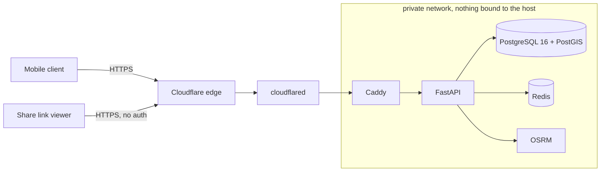

# VORA

Smart mobility for the Cameroonian urban context. Yaounde first, Douala second.

This repository holds the backend, the data model, the API contract and the
security work. The mobile client is built against `openapi.json`.



## What makes this different from a ride-hailing clone

**Landmark-first geocoding.** Street addressing is functionally absent for most
trips here. People navigate by carrefours, stations, markets and quartiers:
"Carrefour Warda", "Total Nsimeyong", "derriere la Poste Centrale". The primary
resolution path is a curated gazetteer with trigram and accent-insensitive
matching, done in the Postgres index rather than in Python, so "carefour warda"
finds "Carrefour Warda". Each result reports which layer of the cascade matched
it, so the client can show provenance instead of guessing confidently.

**Corridor rides.** The dominant real transport mode is not exclusive hire. It
is shared taxis running ramassage along corridors at a per-seat fare. A ride can
be a seat against an in-progress route rather than exclusive hire of a vehicle.
Exclusive hire is supported too; it is the one-passenger case, not the default
the product is built around.

We did not add ride-sharing to a taxi app. We digitised the shared-corridor
model that already exists here, and added exclusive hire on top of it.

## Security and privacy posture

These are constraints on the schema, not product preferences. Cameroon's Law
No. 2024/017 has been enforceable since June 2026.

- No health data, no biometrics, no ethnic, regional or political attributes are
  stored. Accessibility is modelled as **vehicle capability requirements**, never
  as a property of a person.
- No endpoint returns a counterparty's phone number, in any response, at any
  ride state. Canned message templates over the existing socket replace phone
  contact entirely.
- Fares are computed server-side from a server-held GPS trace with a
  plausibility filter. A client-reported distance is never an input to a price.
- Precise driver location reaches only the assigned passenger, and only between
  `accepted` and `completed`.
- Authorization failures on ride-scoped routes return `404`, never `403`. The
  existence of a ride is itself information.
- No secrets in any client. Map, routing and messaging credentials are
  server-side and proxied.

Detail in [THREAT_MODEL.md](THREAT_MODEL.md) and
[ARCHITECTURE.md](ARCHITECTURE.md).

## Quickstart

Requires Docker with Compose v2. Nothing else.

```bash
./scripts/dev_up.sh
```

That generates `.env` with fresh secrets on first run, builds, starts the stack,
and prints both the local and the public HTTPS URL. Then check it end to end:

```bash
./scripts/smoke.sh https://<your-public-host>/api/v1
```

Interactive docs are at `/docs` in development and are disabled in production.

The API binds loopback only. Set `API_HOST_PORT` in `.env` if something already
owns port 8000 on your machine. The public path is Caddy, then a Cloudflare
Tunnel, which gives real TLS on a real hostname with no VPS and no DNS wait; the
generated hostname is printed by `dev_up.sh` and appears in the `cloudflared`
logs. For a hostname that survives a restart, set `CLOUDFLARE_TUNNEL_TOKEN` and
`CLOUDFLARE_TUNNEL_ARGS="tunnel run"` in `.env`.

### Running the tests

```bash
python3 -m venv .venv && .venv/bin/pip install -r requirements-dev.txt
.venv/bin/python -m pytest
```

The Phase 0 tests are contract tests. They need neither Postgres nor Redis.

### Regenerating the API contract

```bash
.venv/bin/python scripts/export_openapi.py
```

`openapi.json` is committed and is what mobile builds against. CI runs the same
script with `--check` and fails if it has drifted.

## Layout

```
app/schemas/     the frozen API contract. A diff here is a contract change.
app/api/v1/      the route surface, one module per §6 group
app/errors/      error codes and the single response envelope
app/middleware/  request id, security headers, body cap, timeout
migrations/      Alembic. Never trust autogenerate; read the diff first.
scripts/         smoke check, contract export, stack bring-up
docs/            contract decisions and phase notes
tools/           throwaway test surfaces (tracking dashboard, share view)
ui/              the design team's mock, not consumed by the backend
```

## Status

Phases 0 and 1 complete: contract frozen and deployed over real TLS, with
phone-OTP authentication, rotating refresh tokens with reuse detection, layered
OTP rate limiting, and the driver KYC gate. Later phases replace
`not_implemented()` route by route, so

```bash
grep -rn "not_implemented(" app/api/
```

is an accurate progress report.

Contract questions resolved at Phase 0 are recorded in
[docs/CONTRACT_DECISIONS.md](docs/CONTRACT_DECISIONS.md).
